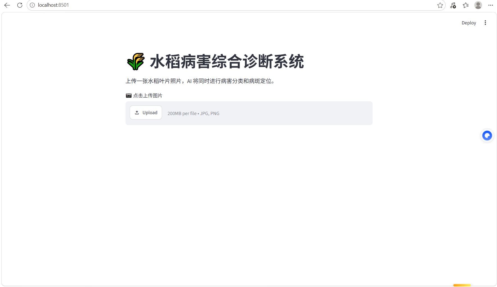
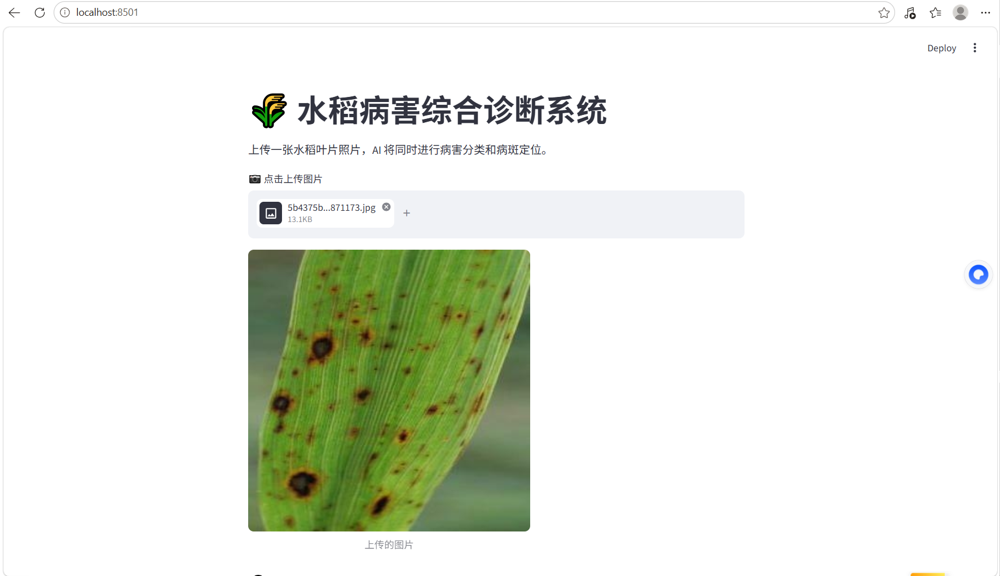
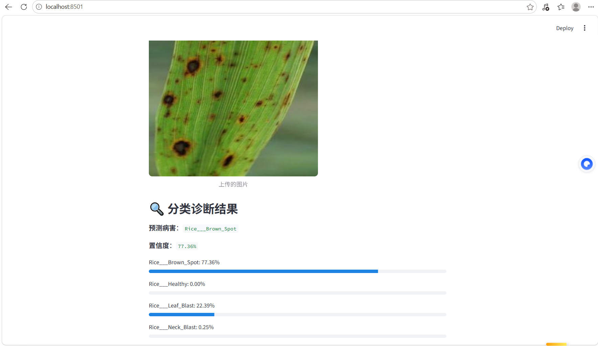
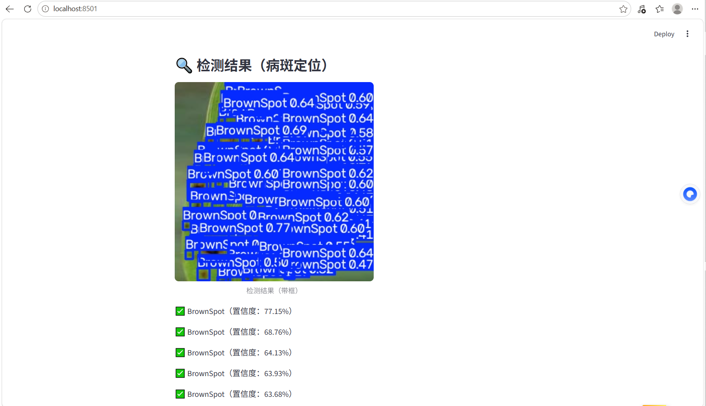
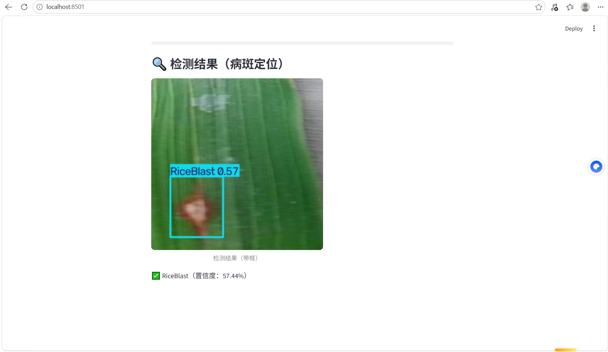

# 🌾 水稻病害综合诊断系统

基于 YOLOv8 的水稻病害分类与目标检测系统。

## 🎯 功能
- **病害分类**：判断水稻叶片属于哪种病害（3 类）
- **病斑检测**：定位并标记病斑位置（3 类）

## 🛠️ 技术栈
- Python 3.10 + PyTorch + YOLOv8 + Streamlit

## 📊 模型性能
| 模型 | 任务 | 准确率 |
|:---|:---|:---|
| 分类模型 | 病害识别 | 97.3% |
| 检测模型 | 病斑定位 | mAP50 = 69% |

## 🚀 快速启动

```bash
pip install -r requirements.txt
streamlit run app_combined.py

```

## 效果展示





